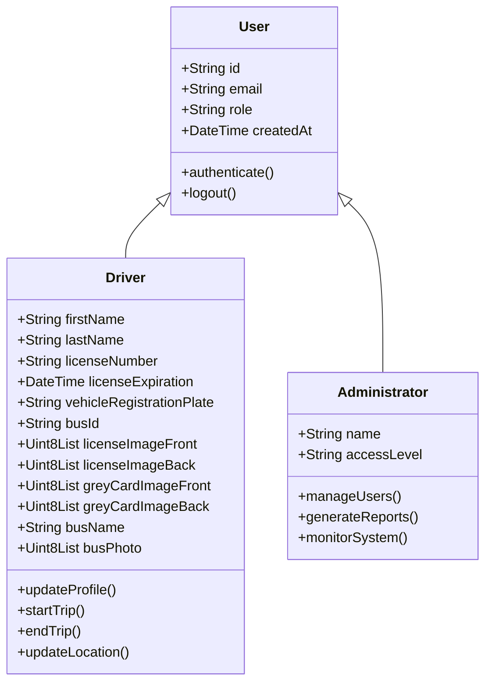
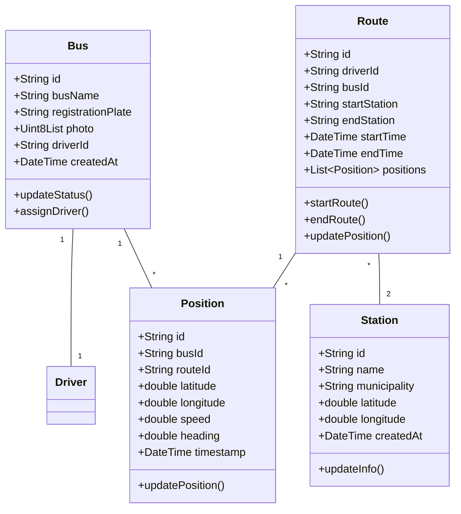
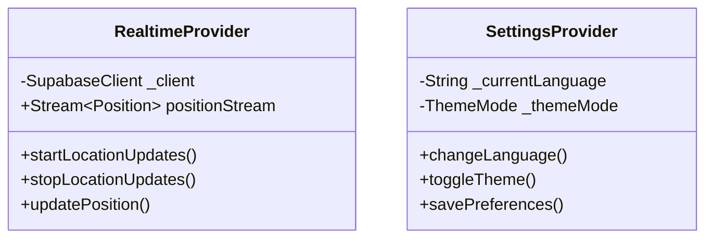
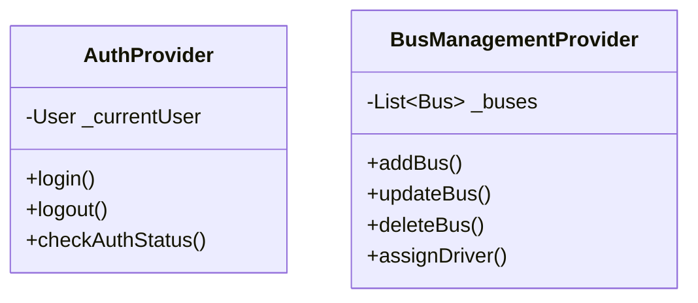
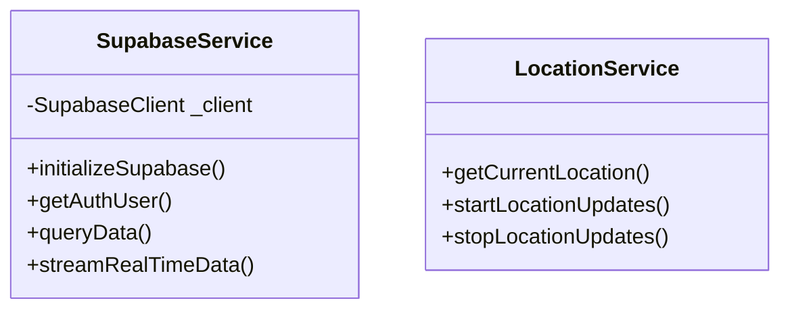

# Class Diagram Documentation

## 1. Overview
This document presents the class diagram of the complete bus management system, including both the mobile application (BusApp) and the administrative dashboard (BusAdmin). The system is built using Flutter/Dart and follows an object-oriented design pattern.

## 2. Core Domain Models

### 2.1 User-Related Classes

### 2.2 Vehicle and Route Classes

## 3. Provider Classes

### 3.1 Mobile Application Providers

### 3.2 Admin Dashboard Providers

## 4. Service Classes

## 5. Class Relationships

### 5.1 Key Relationships
- **User -> Driver/Administrator**: Inheritance relationship where Driver and Administrator extend the base User class
- **Bus -> Driver**: One-to-one relationship where each bus is assigned to one driver
- **Route -> Bus**: One-to-one relationship for active routes
- **Route -> Station**: Many-to-many relationship through route stations
- **Bus -> Position**: One-to-many relationship for tracking history

### 5.2 Provider Dependencies
- RealtimeProvider depends on SupabaseService for real-time updates
- SettingsProvider manages app-wide configurations
- AuthProvider handles user authentication state
- BusManagementProvider manages bus fleet operations

## 6. Implementation Notes

1. **Data Persistence**
   - All model classes implement toJson() and fromJson() methods
   - Database operations are handled through SupabaseService
   - Real-time updates use Supabase's real-time subscriptions

2. **State Management**
   - Provider pattern is used for state management
   - ChangeNotifier is implemented by provider classes
   - Providers are scoped to their respective widget trees

3. **Security**
   - Row Level Security (RLS) policies in Supabase
   - Role-based access control
   - Secure image handling for documents

4. **Real-time Features**
   - Location updates every 5 seconds
   - Real-time bus position tracking
   - Live route status updates

## 7. Future Considerations

1. **Scalability**
   - Consider implementing caching for frequently accessed data
   - Optimize real-time updates for large fleet sizes
   - Implement pagination for large data sets

2. **Maintainability**
   - Keep provider responsibilities focused and specific
   - Maintain clear separation between UI and business logic
   - Document all class relationships and dependencies

3. **Extensions**
   - Plan for additional user roles
   - Consider adding support for multiple fleets
   - Prepare for integration with other transportation systems
