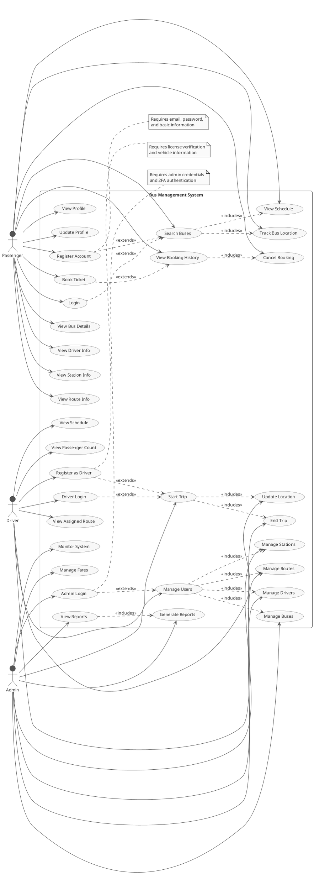

# Global Use Case Diagram - Bus Management System

## Diagram Explanation

### Actors
1. **Passenger**: Regular users who use the bus service
2. **Driver**: Bus drivers who operate the vehicles
3. **Admin**: System administrators who manage the platform

### Key Features

#### Passenger Features
- Account management (registration, login, profile)
- Bus search and tracking
- Schedule and route information
- Booking management

#### Driver Features
- Driver registration and authentication
- Trip management
- Location updates
- Route and schedule access

#### Admin Features
- User management
- Driver management
- Bus and route management
- System monitoring
- Report generation

### Relationships
- **<<includes>>**: Indicates that one use case includes the behavior of another
- **<<extends>>**: Shows optional/conditional behavior

This diagram provides a comprehensive view of all system functionalities and their relationships, with all actors positioned on the left side for clarity.
