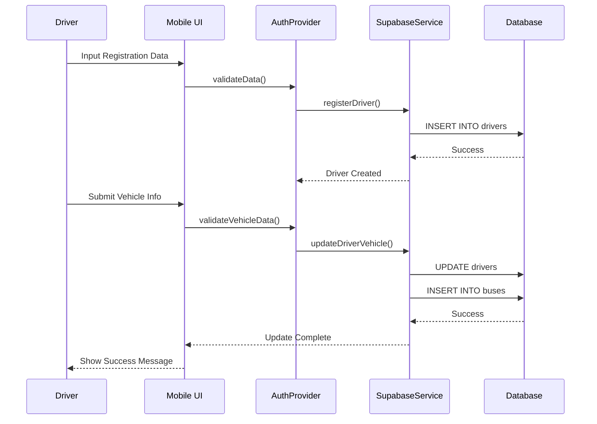
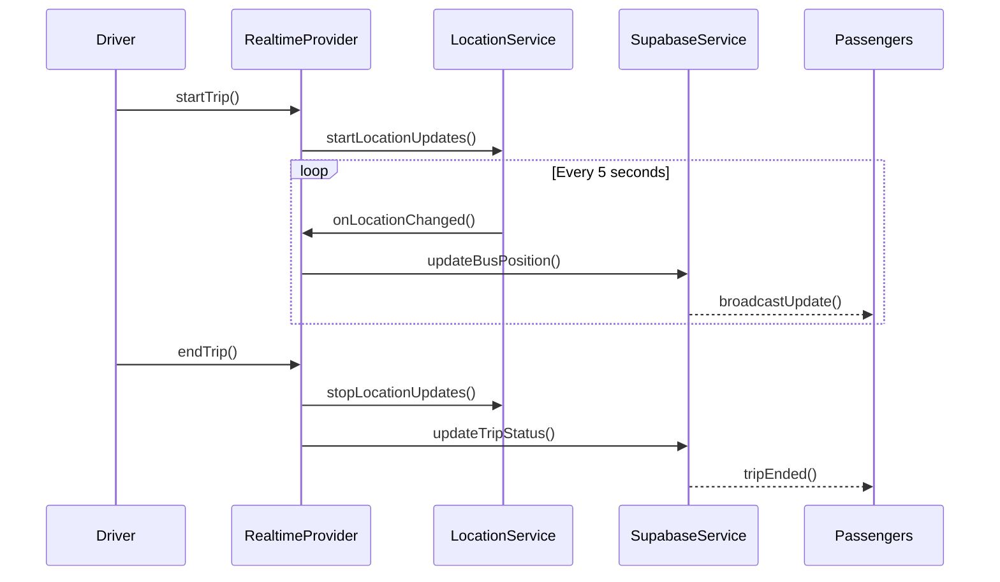
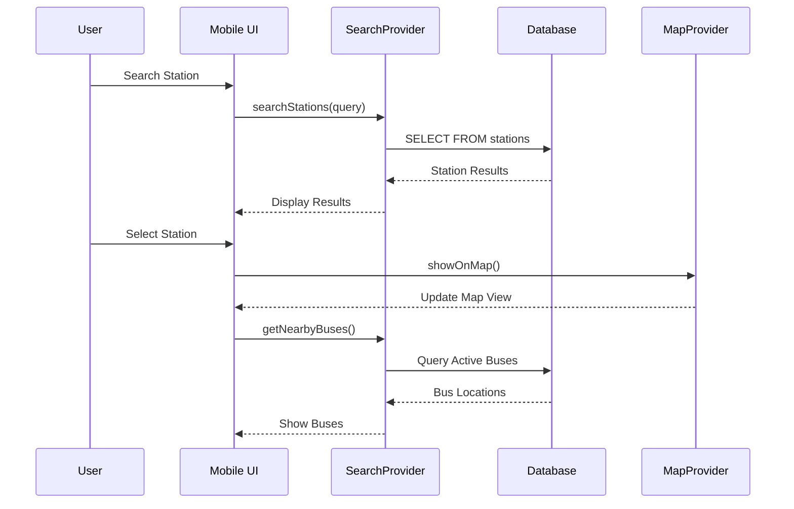
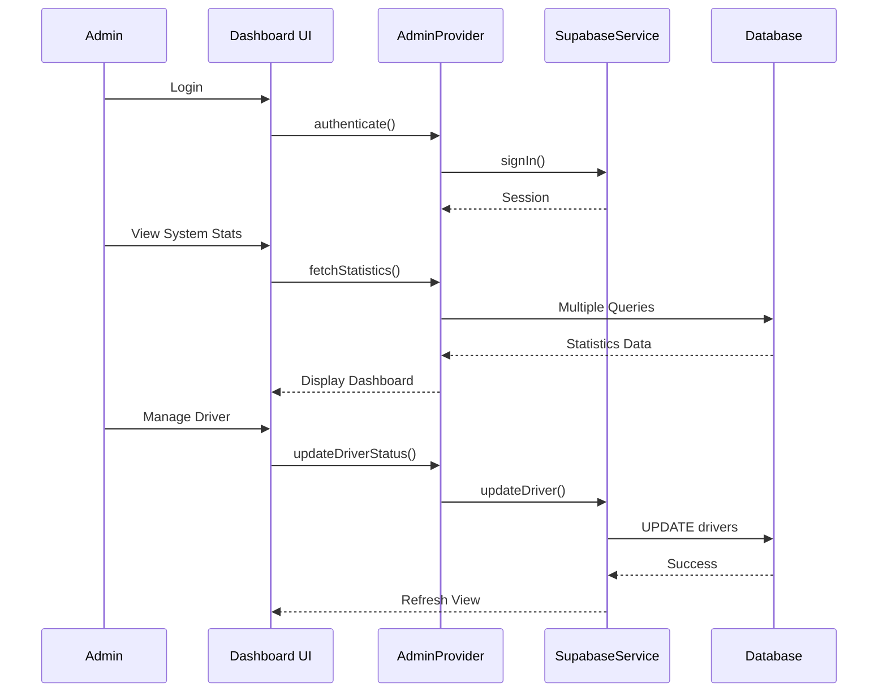
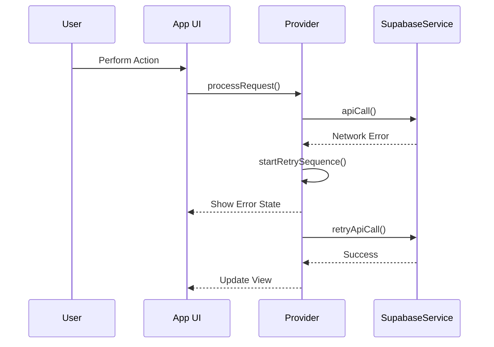
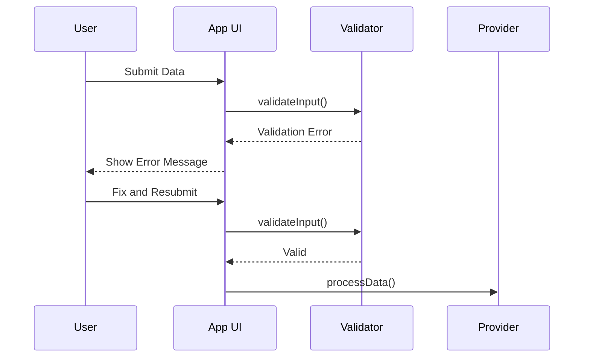

# Sequence Diagram Documentation

## 1. Overview
This document presents the sequence diagrams for key interactions within the bus management system. The diagrams illustrate the flow of operations between different components of both the mobile application (BusApp) and administrative dashboard (BusAdmin).

## 2. Driver Registration and Vehicle Information Submission

## 3. Real-time Bus Tracking Sequence

## 4. Station Search and Route Planning

## 5. Administrative Dashboard Operations

## 6. Key Interaction Patterns

### 6.1 Authentication Flow
1. User inputs credentials
2. AuthProvider validates input
3. SupabaseService attempts authentication
4. Success/failure response handled
5. UI updated accordingly

### 6.2 Real-time Updates
1. Driver initiates trip
2. LocationService begins tracking
3. Position updates sent to server
4. Server broadcasts to subscribers
5. UI components update automatically

### 6.3 Data Management
1. User initiates action
2. Provider validates request
3. SupabaseService processes operation
4. Database updated
5. Real-time updates broadcast
6. UI refreshed

## 7. Error Handling Sequences

### 7.1 Network Error Recovery

### 7.2 Data Validation

## 8. Implementation Notes

### 8.1 Performance Considerations
- Optimize real-time updates frequency
- Implement efficient data caching
- Use pagination for large datasets
- Minimize network requests

### 8.2 Security Measures
- Validate all user input
- Implement proper authentication flows
- Use secure communication channels
- Apply role-based access control

### 8.3 Error Handling
- Implement retry mechanisms
- Provide user feedback
- Log errors for debugging
- Handle edge cases gracefully

## 9. Future Enhancements

1. **Real-time Features**
   - Add websocket connections
   - Implement push notifications
   - Real-time chat support

2. **Performance Improvements**
   - Optimize database queries
   - Implement better caching
   - Add offline support

3. **User Experience**
   - Enhanced error messages
   - Better loading states
   - Smoother transitions
