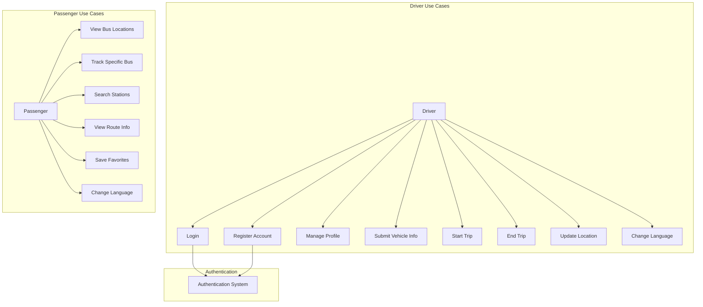
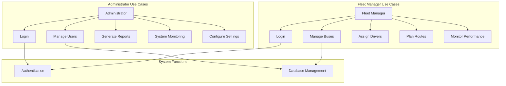

# Use Case Diagram Documentation

## 1. Overview
This document presents the use case diagrams for the bus management system, encompassing both the mobile application (BusApp) and administrative dashboard (BusAdmin). The diagrams illustrate how different actors interact with the system's functionalities.

## 2. Actors Description

### 2.1 Primary Actors

1. **Driver**
   - Professional bus driver
   - Registered and authenticated user
   - Responsible for bus operations and trip management

2. **Passenger**
   - Public transport user
   - Can view bus locations and track routes
   - May have registered account for favorites

3. **Administrator**
   - System administrator
   - Manages users and system configuration
   - Monitors system performance

4. **Fleet Manager**
   - Manages bus fleet
   - Assigns drivers to buses
   - Monitors route efficiency

## 3. Use Case Diagrams

### 3.1 Mobile Application (BusApp)

### 3.2 Administrative Dashboard (BusAdmin)

## 4. Detailed Use Cases

### 4.1 Driver Use Cases

1. **Account Management**
   - Register new account
   - Login to system
   - Update profile information
   - Manage vehicle documentation
   - Change application language

2. **Trip Operations**
   - Start new trip
   - Select route stations
   - Update real-time location
   - End active trip
   - View trip history

### 4.2 Passenger Use Cases

1. **Bus Tracking**
   - View all active buses
   - Track specific bus
   - View bus details
   - See estimated arrival times

2. **Route Management**
   - Search for stations
   - View route information
   - Save favorite routes
   - Get trip notifications

### 4.3 Administrator Use Cases

1. **User Management**
   - Create admin accounts
   - Manage user permissions
   - Handle user issues
   - Monitor user activity

2. **System Administration**
   - Monitor system health
   - Generate performance reports
   - Configure system settings
   - Manage database

### 4.4 Fleet Manager Use Cases

1. **Fleet Management**
   - Register new buses
   - Assign drivers to buses
   - Monitor bus status
   - Track maintenance

2. **Route Planning**
   - Create new routes
   - Optimize existing routes
   - Monitor route efficiency
   - Generate route reports

## 5. Use Case Relationships

### 5.1 Include Relationships
- All authenticated operations include "Login"
- All location updates include "Check GPS Status"
- All data modifications include "Validate Data"

### 5.2 Extend Relationships
- "Save Favorites" extends "View Route Info"
- "Generate Reports" extends "Monitor Performance"
- "Send Notifications" extends "Track Bus"

## 6. Implementation Notes

### 6.1 Security Considerations
- Authentication required for all sensitive operations
- Role-based access control
- Data validation for all inputs
- Secure storage of credentials

### 6.2 Performance Requirements
- Real-time location updates (5-second intervals)
- Quick response time for search operations
- Efficient data synchronization
- Smooth map interactions

### 6.3 Error Handling
- Network connectivity issues
- GPS signal loss
- Invalid data input
- System unavailability

## 7. Future Extensions

1. **Planned Features**
   - Integration with payment systems
   - Advanced analytics dashboard
   - Predictive arrival times
   - Multi-language support expansion

2. **Potential Enhancements**
   - Mobile ticket validation
   - Real-time chat support
   - Automated route optimization
   - Passenger counting system

## 8. Conclusion
These use case diagrams provide a comprehensive view of system functionality and user interactions. They serve as a foundation for development and future enhancements while ensuring all stakeholder needs are addressed.
